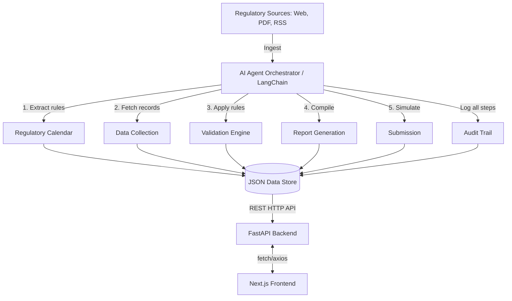

```mermaid
graph TD
    %% Source to Agent
    Sources[Regulatory Sources: Web, PDF, RSS] --> |Ingest| AgentOrchestrator[AI Agent Orchestrator / LangChain]
    
    %% Agent Steps
    AgentOrchestrator --> |1. Extract rules| RegCalendarGen[Regulatory Calendar]
    AgentOrchestrator --> |2. Fetch records| DataCollection[Data Collection]
    AgentOrchestrator --> |3. Apply rules| ValidationEngine[Validation Engine]
    AgentOrchestrator --> |4. Compile| ReportGen[Report Generation]
    AgentOrchestrator --> |5. Simulate| Submission[Submission]
    
    %% Output to Frontend
    RegCalendarGen --> DB[(JSON Data Store)]
    DataCollection --> DB
    ValidationEngine --> DB
    ReportGen --> DB
    Submission --> DB
    
    %% Audit
    AgentOrchestrator --> |Log all steps| AuditLog[Audit Trail]
    AuditLog --> DB
    
    %% Frontend
    DB --> |REST HTTP API| Backend[FastAPI Backend]
    Backend <--> |fetch/axios| Frontend[Next.js Frontend]
```
