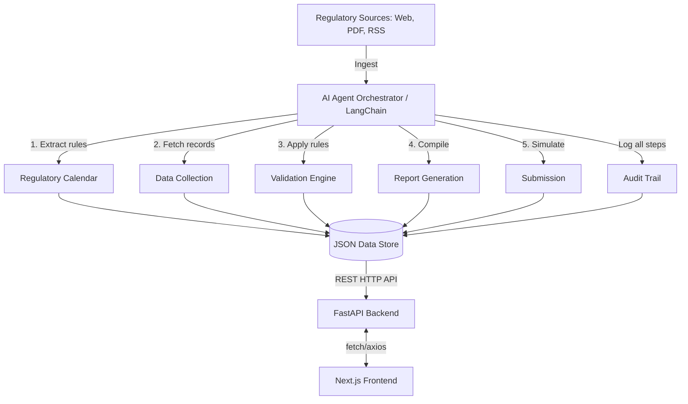

# AI Compliance Monitoring Agent - Technical Design Document

## 1. Project Overview
The AI Compliance Monitoring Agent is an intelligent, automated system designed to streamline the lifecycle of regulatory compliance for organizations such as financial services or healthcare providers. The system automatically detects new regulatory updates from diverse sources, extracts reporting obligations, and orchestrates the end-to-end compliance workflow. This includes generating regulatory calendars, collecting necessary internal data, validating it against compliance constraints, generating reports, simulating submissions, and maintaining a robust audit trail. By automating these processes, the system reduces manual labor, minimizes the risk of human error, and ensures continuous regulatory adherence.

## 2. System Architecture
The system follows a decoupled, agent-driven architecture:
- **AI Agent Orchestrator (LangChain & Python)**: Acts as the brain of the system, determining which tools and workflows to trigger based on regulatory inputs and system states.
- **Backend API (FastAPI)**: Provides RESTful endpoints that trigger the AI agent workflows, retrieve generated artifacts (calendars, reports), and serve data to the frontend.
- **Data Layer (JSON/Pandas)**: A lightweight local JSON-based storage for prototypes, coupled with Pandas for fast and efficient internal data processing and validation.
- **Frontend Dashboard (Next.js/React)**: A modern, responsive dashboard that interacts with the FastAPI backend, giving users a complete visual overview of triggered compliance events, violations, required reports, and audit logs.

## 3. Architecture Diagram



## 4. Technology Stack
- **FastAPI**: Selected for its high performance, native asynchronous support, and automatic OpenAPI documentation. Ideal for serving AI agent actions rapidly.
- **LangChain**: Picked for agent orchestration. It provides standard primitives to equip LLMs with tools (e.g., retrieving data, writing reports) and chaining complex logical reasoning steps.
- **Python**: The industry standard for AI and data manipulation.
- **Pandas**: Offers robust and vectorized operations to quickly aggregate dummy datasets, check types, and find threshold violations or anomalies in large tabular data.
- **JSON (Storage)**: Simplifies prototype development. It eliminates the need for database migrations while providing a flexible schema to represent calendars, logs, and reports.
- **Next.js (React)**: Enables rapid development of dynamic, robust frontend dashboards with built-in routing and easy component reusability.

## 5. Project Folder Structure

```text
backend/
├── app/
│   ├── main.py                  # FastAPI application entry point
│   ├── agents/                  # LangChain agent orchestration & prompts
│   ├── services/                # Core business logic modules
│   │   ├── regulation_monitor.py
│   │   ├── regulatory_calendar.py
│   │   ├── data_collector.py
│   │   ├── validation_engine.py
│   │   ├── report_generator.py
│   │   ├── submission_service.py
│   │   └── audit_logger.py
│   ├── models/                  # Pydantic data models for request/response
│   ├── utils/                   # Helper functions (JSON DB helpers)
│   └── data/                    # Local JSON datastore & CSV datasets
│       ├── transactions.csv
│       └── db.json              # Simulated JSON database

frontend/
├── app/
│   ├── layout.tsx               # Next.js App Router root layout
│   ├── page.tsx                 # Dashboard main page
│   ├── calendar/page.tsx        # Regulatory Calendar page
│   ├── validation/page.tsx      # Validation Results page
│   ├── report/page.tsx          # Compliance Report page
│   └── audit/page.tsx           # Audit Log page
├── components/                  # Reusable UI components
│   ├── DashboardCard.tsx
│   ├── ValidationTable.tsx
│   ├── ReportViewer.tsx
│   ├── AuditLogTable.tsx
│   └── RunWorkflowButton.tsx
└── services/                    # Axios/fetch API wrappers
    └── api.ts
```

## 6. Component Design
- **`regulation_monitor.py`**: Parses incoming external sources (e.g., mock text representing a PDF) to extract the plain-text regulatory update.
- **`regulatory_calendar.py`**: Interacts with the LLM to map monitored updates into structured JSON obligations (rule, frequency, threshold, deadline).
- **`data_collector.py`**: Loads internal mock datasets (e.g., Pandas reading from CSVs) required by the specific regulation context.
- **`validation_engine.py`**: Applies rule-based checks on the Pandas DataFrame (e.g., identifying missing fields or `amount > 10000`).
- **`report_generator.py`**: Aggregates the validation results into a formalized, human-readable compliance template using the LLM.
- **`submission_service.py`**: Simulates the network payload submission to a mock external regulatory authority endpoint.
- **`audit_logger.py`**: A cross-cutting utility that persistently records the current timestamp, the agent step, inputs, and outputs to `logs.json`.

**LangChain Orchestration**:
LangChain represents these modules as `@tool` decorated functions. The core agent is initialized with these tools and an overarching prompt. When the user requests a compliance run, the agent iterates through the steps, utilizing the tools sequentially.

## 7. AI Agent Workflow
1. **Initialize**: LangChain `ReAct` or `OpenAIFunctionsAgent` is invoked via FastAPI.
2. **Observe**: The agent reads the parsed mock regulation using the Monitor Tool.
3. **Decide & Act (Calendar)**: Agent parses the text, extracts obligations, and calls the Calendar Builder Tool to persist the deadlines.
4. **Decide & Act (Data)**: Realizing it needs to check compliance, the agent calls the Data Collector Tool to load `transactions.csv`.
5. **Decide & Act (Validate)**: Agent hands the dataset to the Validation Tool alongside the extracted thresholds.
6. **Decide & Act (Report)**: Agent passes the validated failures into the Report Generator Tool.
7. **Decide & Act (Submit)**: Agent invokes the Submission Tool.
8. **Finalize**: At each function invocation, the `audit_logger.py` hook automatically captures the agent's thought process and specific tool payloads.

## 8. Backend API Design (FastAPI)

### Endpoints

- **POST /run-compliance-check**
  - **Request**: `{ "source_text": "All transactions over $10,000 must be reported within 24 hours." }`
  - **Response**: `{ "status": "success", "run_id": "req-1234", "message": "Workflow completed." }`

- **GET /regulatory-calendar**
  - **Response**:
  ```json
  [
    {
      "id": 1,
      "reporting_rule": "Large Transaction Report",
      "reporting_frequency": "Daily",
      "threshold_conditions": "Amount > 10000",
      "deadline": "24 hours past transaction"
    }
  ]
  ```

- **GET /validation-results**
  - **Response**:
  ```json
  [
    {
      "transaction_id": "TXN-9912",
      "violation": "Threshold Violation",
      "details": "Amount $12,500 exceeds $10,000 without report flag"
    }
  ]
  ```

- **GET /report**
  - **Response**: `{ "report_id": 101, "content": "Template...", "status": "Ready" }`

- **GET /audit-log**
  - **Response**: 
  ```json
  [
    {
      "timestamp": "2026-03-09T10:00:00Z",
      "step": "Data Collection",
      "input": "transactions.csv",
      "output": "Loaded 500 records. 2 missing values found.",
      "status": "SUCCESS"
    }
  ]
  ```

### Example FastAPI Code Snippet
```python
from fastapi import FastAPI, BackgroundTasks
from pydantic import BaseModel
from app.agents.compliance_agent import run_agent_workflow

app = FastAPI(title="AI Compliance Monitoring API")

class ComplianceRequest(BaseModel):
    source_text: str

@app.post("/run-compliance-check")
async def run_compliance_check(req: ComplianceRequest, background_tasks: BackgroundTasks):
    # Run the langchain orchestration asynchronously
    background_tasks.add_task(run_agent_workflow, req.source_text)
    return {"status": "Processing initiated", "message": "The AI Agent has started workflow."}
```

## 9. Frontend Design (Next.js)

The frontend is a multi-page dashboard application built with Next.js App Router, styled with TailwindCSS for a clean, professional aesthetic.

**Layout & Pages**:
- **Sidebar**: Links to Dashboard, Regulatory Calendar, Validation Results, Compliance Report, and Audit Log.
- **Dashboard**: Central overview featuring a `RunWorkflowButton`. Includes four `DashboardCard`s visualizing critical metrics (e.g., Regulations Detected, Violations Found, Report Status, Submission Status).
- **Regulatory Calendar**: A data table showing upcoming compliance deadlines.
- **Validation Results**: A detailed list of individual transaction failures and error reasons.
- **Compliance Report**: View showing the generated compliance markdown payload and the state of submission.
- **Audit Log**: A read-only streaming sequence of agent actions and timestamps.

## 10. Next.js Components

### Example Component: `DashboardCard.tsx`
```tsx
import React from 'react';

interface DashboardCardProps {
  title: string;
  value: string | number;
  description: string;
}

export const DashboardCard: React.FC<DashboardCardProps> = ({ title, value, description }) => {
  return (
    <div className="p-6 bg-white rounded-xl shadow-md border border-gray-100 flex flex-col">
      <h3 className="text-gray-500 text-sm font-semibold uppercase">{title}</h3>
      <div className="text-3xl font-bold text-gray-800 my-2">{value}</div>
      <p className="text-xs text-gray-400">{description}</p>
    </div>
  );
}
```

### Example Component: `RunWorkflowButton.tsx`
```tsx
"use client";
import React, { useState } from 'react';

export const RunWorkflowButton = () => {
    const [loading, setLoading] = useState(false);

    const handleRun = async () => {
        setLoading(true);
        await fetch('/api/run-compliance-check', {
            method: 'POST',
            headers: { 'Content-Type': 'application/json' },
            body: JSON.stringify({ source_text: "New regulation: >10k amounts required." })
        });
        setLoading(false);
        alert('Workflow Triggered!');
    }

    return (
        <button 
           onClick={handleRun} 
           disabled={loading}
           className="bg-blue-600 hover:bg-blue-700 text-white font-bold py-3 px-6 rounded-lg transition-all">
            {loading ? 'Agent Running...' : 'Run Compliance Workflow'}
        </button>
    );
};
```

## 11. API Integration
The Next.js frontend utilizes standard native `fetch` API for communication with the FastAPI backend. 

```ts
// services/api.ts
export const fetchValidationResults = async () => {
  const response = await fetch("http://localhost:8000/validation-results");
  if (!response.ok) throw new Error("API call failed");
  return response.json();
};
```

## 12. Example Dataset

**`transactions.csv`**
```csv
transaction_id,amount,date,customer_id,status
TXN-001,4500.00,2026-03-09,CUST-99,CLEARED
TXN-002,12500.00,2026-03-09,CUST-12,PENDING
TXN-003,150.00,2026-03-09,CUST-44,CLEARED
TXN-004,,2026-03-09,CUST-88,CLEARED
TXN-005,10500.00,2026-03-09,CUST-19,CLEARED
```
*(Notice `TXN-004` has a missing amount, and `TXN-002` / `TXN-005` violate the 10k threshold).*

## 13. Validation Logic
The validation engine utilizes Pandas. Rule example: "Transactions above 10,000 must be reported."

### Python Validation Snippet:
```python
import pandas as pd

def run_validation_rules(csv_path: str):
    df = pd.read_csv(csv_path)
    anomalies = []
    
    # Check 1: Missing values
    missing = df[df['amount'].isnull()]
    for idx, row in missing.iterrows():
        anomalies.append({"transaction_id": row['transaction_id'], "error": "Missing amount"})
        
    # Check 2: Threshold limits
    threshold_violations = df[df['amount'] > 10000]
    for idx, row in threshold_violations.iterrows():
        anomalies.append({
            "transaction_id": row['transaction_id'], 
            "error": f"Amount {row['amount']} exceeds 10,000"
        })
        
    return anomalies
```

## 14. Compliance Report Template

**Generated Report Structure:**
```text
===================================================
        REGULATORY COMPLIANCE REPORT
===================================================
Date Generated: 2026-03-09
Target Regulation: FIN-REG-101 (Large Transaction Rule)

1. SUMMARY OF REVIEW
Total Transactions Processed: 5
Total Flagged for Review: 3

2. THRESHOLD VIOLATIONS (Over $10,000)
- TXN-002: $12,500.00 (Date: 2026-03-09)
- TXN-005: $10,500.00 (Date: 2026-03-09)

3. DATA ANOMALIES / MISSING INFORMATION
- TXN-004: Missing transaction amount field.

4. ACTION REQUIRED
Ensure missing data for TXN-004 is reconciled.
Submit details for TXN-002 and TXN-005. 
===================================================
```

## 15. Audit Logging System
Whenever a LangChain `@tool` is triggered, an audit hook extracts the `agent_action`, `tool_name`, `input_args`, and `timestamp`, appending it strictly to `audit_logs.json`. The Next.js frontend subsequently queries this log to provide users with a step-by-step verifiable trace of system actions, acting as definitive proof of compliance.

## 16. Error Handling
- **Missing Data**: Handled through custom Python exceptions (`DataIngestionError`), causing the agent to document the failure cleanly rather than crashing.
- **API Failures**: Simulation of submission makes use of the `tenacity` library to retry requests; falls back to an error alert status in the dashboard.
- **Validation Errors**: Pandas `pd.to_numeric(errors='coerce')` handles dirty dataset schemas safely.
- **New Regulations**: If the agent's LLM fails to define a threshold cleanly, it marks "Expert Review Required", suspending automated submissions to await a user decision.

## 17. Test Scenarios
1. **Normal reporting cycle**: Clean dataset fed directly through the validation steps; zero flags raised and cleanly submitted.
2. **Missing internal data fields**: The CSV is entirely stripped of essential target columns; Validation Engine alerts the user via Data Anomalies.
3. **New regulation introduced**: A new input rule changes the reporting threshold from $10k to $5k. System adapts and re-groups failures on the fly.
4. **Validation rule failure**: An injected non-numeric value tests the engine's conversion limits and throws UI data format warnings.
5. **Source system unavailable**: Submission endpoint forcibly set to timeout. System retries and eventually queues the file for later while issuing an Audit log alert.

## 18. Deployment
Local developers can preview the full stack out-of-the-box natively. 

**Run FastAPI Backend:**
```bash
cd backend
python -m venv venv
source venv/bin/activate
pip install -r requirements.txt
uvicorn app.main:app --reload --port 8000
```

**Run Next.js Frontend:**
```bash
cd frontend
npm install
npm run dev
```

## 19. Demo Walkthrough
For a 30-minute interview:
1. **[0-5  min] Arch Overview**: Showcase Next.js UI structure and provide a short summary of backend AI patterns.
2. **[5-10 min] Rule Ingestion**: Provide dummy regulatory text via the dashboard to watch the backend Calendar Engine generate structured tasks.
3. **[10-20 min] Validation**: Click "Run Compliance Workflow" and review output on the Validation Results page to showcase Pandas DataFrame manipulations against dummy Data in action.
4. **[20-25 min] Traceability**: Step through the final generated Markdown report, then switch to Audit Trails to verify deterministic AI interactions.
5. **[25-30 min] Code deep dive**: Direct code walk highlighting custom LangChain `tools` declarations and Next.js frontend component setups.

## 20. Future Improvements
- **Scalable Database Strategy**: Moving from a localized JSON file to PostgreSQL handling transactional rows and leveraging Pinecone vector search for scanning vast internal compliance rulesets.
- **Event-Driven Messaging**: Employing event buses (e.g., Kafka) rather than direct API chains to improve concurrency handling during load peaks.
- **Determined Multi-Agent Paths**: Implementation of LangGraph to construct deeply bound state-machine LLM workflows, decreasing hallucination potentials across intricate healthcare and financial rule layers.
- **Authentication**: Implementing NextAuth to guarantee stringent RBAC (Role-Based Access Control) permissions prior to kicking off any submissions.
